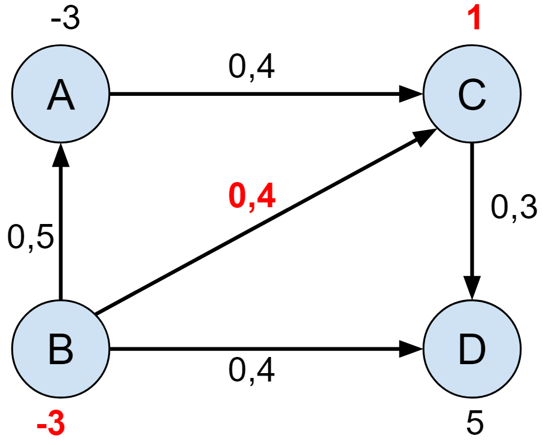

# Circulation With Demands (Network Flow)
Given a directed graph with edge capacities and vertex demands, is there a circulation of flow?

## Problem Statement
- Directed Graph
- Edge Capacities c(e) > 0
- Demands on vertices **d(v)**
    - **Demand** if d(v) > 0
    - **Supply** if d(v) < 0
    - **Trans-flow** if d(v) = 0

**For each vertex, flow in minus flow out must match the demand/supply of the vertex**  
fin(v) – fout(v) = d(v)  
Where f(v) is flow assigned

Is there a circulation in these graphs?  

# Solution
- Add source & sink
- Add edges (**S**, **v**) for all **supply** vertices (d(v)<0) with **edge capacity -d(v)**
- Add edges (**v**, **T**) for **demand** vertices (d(vO>0)) with **capacity d(v)**
- Find Max flow with Ford-Fulkerson

**Graph has circulation if maxFlow = sum of supplies  
Mincut should just contain the source `S`**

### Graph 1
  

**Add Source and Sink**  
  
**Ford-Fulkerson Finds Max flow**  
  
#### **Max Flow = 6 (has circulation)**

 

### Graph 2 (no circulation)
  

Vertex **B**'s supply is too high this time  
**No circulation since sum of supplies is not equal to sum of demands: 5 ≠ 6**

### Graph 3 (no circulation)
  

This time the capacity of an edge causes no circulation  
Edge **[(B, D) capacity=2]** limits max flow to **5** even though the sum of demands equals sum of supplies

 

### Graph 4
  

**Add source and sink**  
  
**Ford-Fulkerson finds max flow circulation**  

#### **Max Flow = 21 (has circulation)**

 

## Lower Bounds
Edge capacities can have lower bounds, not just upper bounds  
  
Edge **(B, C)** has a capacity range of **[1,5]**  
All other edges have lower bound of 0, so essentially the same as before

### Adjusting Lower Bounds
- Subtract the lower bound from the upper bound
- Update both end vertices of the edge
    - Supply vertices have **negative** demand so **add the lower bound**
    - Demand vertices have **positive** demand so **subtract the lower bound**

### Graph 5
  

**Add source and sink & Ford-Fulkerson finds max flow**  

#### **Max Flow = 6 (has circulation)**

## Usage
**The code will take an input graph and modify it by adding source and sink nodes, connecting edges to demands/supplies and adjusting for lower bounds**

- Create a new graph & **specify the number of vertices in the ORIGINAL graph (without S & T)**  
    `FlowNetworkGraph graph1 = new FlowNetworkGraph(4);`
- Add edges that exist in the graph  
    - `FlowEdge` constructor parameters are `(int fromVertex, int toVertex, double capacity)`
    - `graph1.addEdge(new FlowEdge(0, 2, 3));`  
    - `graph1.addEdge(new FlowEdge(0, 3, 1));`  
    - *add more edges*
- The code refers to vertices by `int` indexes, so create an `ArrayList` to convert to `String` names  
   - `ArrayList<String> vertexNameGraph1 = new ArrayList<String>(Arrays.asList("A", "B", "C", "D"));`
    - Here vertex `0` is **A**, `1` is **B**, etc.
- Make an array to hold supply/demand values for vertices  
   `int[] vertexDemandGraph1 = {-3, -3, 2, 4};`
- Create a new `CirculationWithDemands` object which will modify the graph & run Ford-Fulkerson  
   `CirculationWithDemands circulationFinderGraph1 = new CirculationWithDemands(graph1, vertexNameGraph1, vertexDemandGraph1);`
- &nbsp;
- Lower bounds
    - No need to put lower bounds of 0, it's assumed
    - Only use the `FlowEdge` constructor with `4` arguments if it has a lower bound: `(int fromVertex, int toVertex, double lowerBound, double upperBound)`  
    `graph5.addEdge(new FlowEdge(1, 2, 1, 5));`
    - All other edges in `graph5` are simple & have default lower bound of `0`

## Code Details
- Graph is kind a modified **adjacency list** but created via an edge list approach
- Checks whether certain things would break conditions for circulation
- `doDemandsMatchSupplies` is checked twice if the graph has lower bounds after adjusting capacities
- Works for graphs without lower bounds and skips that part altogether
- Uses breadth first search

## References
- [Ford-Fulkerson - Codebytes](http://www.codebytes.in/2015/12/finding-maxflow-mincut-using-ford.html) adapted basic Ford-Fuolkerson code
- [Max-Flow Extensions - Carl Kingsford](https://www.cs.cmu.edu/~ckingsf/bioinfo-lectures/flowext.pdf) slides
- [Circulation with demands - Kevin Wayne](https://www.cs.princeton.edu/~wayne/kleinberg-tardos/pdf/07NetworkFlowII.pdf#page=36) slides
- [Circulation - Susan Haynes](https://www.youtube.com/watch?v=ZBFL_Bd5w_k)
- [Circulation with Lower Bounds - Susan Haynes](https://www.youtube.com/watch?v=GXx-j06OtWg) lower bounds graph
- [Stefano Scerra's blog code](http://www.stefanoscerra.it/java-max-flow-graph-algorithm/) edge list code, didn't use

### Other References
- [Ford-Fulkerson codereview.stackexchange](https://codereview.stackexchange.com/questions/45729/ford-fulkerson-algorithm) early attempts, couldn't get code to compile
- [Ford-Fulkerson - GeeksForGeeks](http://www.geeksforgeeks.org/ford-fulkerson-algorithm-for-maximum-flow-problem/) adjacency matrix version couldn't be easily adapted
- [Ford-Fulkerson - Tushar Roy / mission-peace GitHub](https://github.com/mission-peace/interview/blob/master/src/com/interview/graph/FordFulkerson.java) adjacency matrix version with sample graph
- [Ford-Fulkerson - irpap GitHub](https://gist.github.com/irpap/3454980) simple adjacency matrix, no testing graphs
- [Ford-Fulkerson - Sanfoundry](http://www.sanfoundry.com/java-program-implement-ford-fulkerson-algorithm/) adjacency matrix, required user input text parsing
- [Ford-Fulkerson - codereview.stackexchange](https://codereview.stackexchange.com/questions/106335/ford-fulkerson-algorithm-max-flow) complicated user input parsing to enter graphs
- [Ford-Fulkerson - algosdotorg](https://algosdotorg.wordpress.com/ford-fulkerson-max-flow-java-edgelist/) complicated code
- [Keith Schwarz](http://www.keithschwarz.com/interesting/code/ford-fulkerson/FordFulkerson.java.html) code too long
- [Robert Sedgewick, Kevin Wayne](http://algs4.cs.princeton.edu/64maxflow/FordFulkerson.java.html) too long
